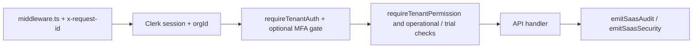
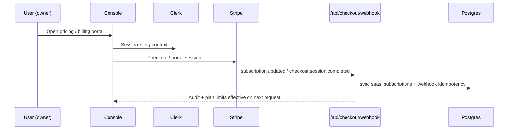

# Blackglass

Next.js **16** fleet console for baselines, configuration drift, optional **Charon** cloud inventory (DO/AWS/GCP), evidence exports, Stripe billing hooks, and DigitalOcean-ready deployment.

## Requirements

- **Node.js** `22.x` (`>=22 <23`; see [.nvmrc](.nvmrc))
- **npm** `>=10`

## Quick start

```bash
npm ci
cp .env.example .env.local   # Linux/macOS — on Windows copy manually
npm run dev
```

**Postgres + Redis via Docker:** `docker compose -f docker-compose.dev.yml up -d`, then merge the env block in [docs/local-dev-docker.md](docs/local-dev-docker.md) into `.env.local` and run `npm run db:migrate`.

Optional: `npm run dev:doppler` via [Doppler](https://docs.doppler.com/), or PowerShell helper `scripts/doppler-dev.ps1`.

**Cursor canvases:** [`canvases/project-overview.canvas.tsx`](canvases/project-overview.canvas.tsx) is the stakeholder review packet; [`canvases/outstanding-actions.canvas.tsx`](canvases/outstanding-actions.canvas.tsx) is the prioritised founder/operator queue (both are [Cursor Canvas](https://cursor.com) files — import `cursor/canvas`, not part of the Next.js build). Open them from the Cursor project `canvases/` directory beside the chat; the copies under `canvases/` in this repo are mirrors for version control.

## NPM scripts

| Script | Purpose |
|--------|---------|
| `dev` | Local Next.js dev server |
| `build` / `start` | Production bundle; `start` assumes prior `next build` with standalone output (`next.config.ts`) |
| `lint` | ESLint CLI (`eslint.config.mjs`) |
| `check:rls-bypass` | Enforces `// RLS-BYPASS:` ↔ `withBypassRls(` count parity under `src/` (also in `verify:stage0` + CI) |
| `typecheck` | `tsc --noEmit` |
| `test:unit` | Vitest |
| `test:e2e` | Playwright (needs dev server via config) |
| `test:e2e:visual` | Playwright **@pixel** screenshot baselines (`theme-visual.spec.ts`); use `--update-snapshots` after intentional marketing UI changes |
| `test:e2e:all` | Full Playwright suite including `@pixel` |
| `check:openapi` | OpenAPI ↔ `route.ts` parity |
| `schemas:export` | Regenerate `openapi/zod-schemas.json` from Zod |
| `verify:stage0` | CI-shaped gate (lint + **check:rls-bypass** + OpenAPI + schema diff + **typecheck** + unit + build — no Playwright) |
| `verify:stage0:clean` | **`clean:next`** then **`verify:stage0`** — helps Windows cloud-sync **`readlink`** failures |
| `clean:next` | Deletes **`.next/`** (`scripts/clean-next.mjs`) |
| `verify:staging` | Hit `STAGING_URL` health/hosts audit (`VERIFY_SECRETS_PROBE=1` optional) |
| `audit:export-spaces` | List/download Spaces `audit/*.jsonl` (needs `DO_SPACES_*`; see [docs/audit-trail.md](docs/audit-trail.md)) |
| `audit:verify-jsonl` | Deterministic NDJSON integrity digest (`stdin` or file argument) |
| `load:rate-local` | Burst `POST /api/v1/scans` until HTTP 429 (local dev; `BASE_URL`, `BURST_LIMIT`) |
| `pen-test:smoke` | Print curl snippets for quick manual probes (`BASE_URL` optional) |
| `blackglassctl` | Minimal health / scan CLI (`node scripts/blackglassctl.mjs help` pattern) |
| `email:test` | Resend marketing/transactional template probe — `npm run email:test -- --to=you@example.com` (needs **`RESEND_API_KEY`** in env or `.env.local`; optional `EMAIL_FROM`, `NEXT_PUBLIC_APP_URL`) |
| `ops:selfcheck` | Fail CI if any `.github/workflows` `node scripts/…` reference points at a missing file (`scripts/ops-automation-selfcheck.mjs`) |
| `prune:webhooks` | Delete old `saas_webhook_idempotency` rows (`DATABASE_URL`, optional `--days=`) |
| `stripe:setup` | Interactive Stripe webhook/price bootstrap ([script](scripts/stripe-setup.mjs)) |
| `do:apply-stage0` | Applies Stage-0 auth env on an existing DO app |

**DigitalOcean App Platform:** deploy builds use `npm ci` and `next build` only; rely on your CI pipeline for `lint`. ESLint on DO builders is a common source of flaky or persistent failures if you add it to `build_command` — see [.do/README.md](.do/README.md#eslint-and-app-platform).

## Release & operations

1. **`npm run verify:stage0`** before pushing substantive changes (or merge only when CI is green).
2. **Database:** apply migrations against target Postgres — `npm run db:migrate` (see `drizzle/*.sql`).
3. **Workers:** with **Redis**, run **ops-worker** alongside the web app (retention, webhooks, exports; also expires stuck async baseline capture jobs).
4. **Smoke (prod):** baseline capture, report PDF download, legal links from the console.
5. **Console gate + invites:** when `AUTH_REQUIRED=true`, keep **`AUTH_SESSION_SECRET`** set in production — it signs admin sessions and **HMAC-signed invite links** (`iv1.*`); optional dedicated **`INVITE_SIGNING_SECRET`** overrides invite signing only.
6. **Compliance cadence & incidents:** [docs/compliance/review-cadence.md](docs/compliance/review-cadence.md), [docs/runbooks/data-breach-response.md](docs/runbooks/data-breach-response.md), [docs/runbooks/operations.md](docs/runbooks/operations.md).

## Maintenance & upgrades

- **Dependabot:** Weekly npm + workflow dependency PRs — triage merges or close with rationale; **`npm audit --audit-level=high --omit=dev`** runs on every CI push. Moderate **`postcss`** advisories via **`next/node_modules`** may persist until **Next** ships patched deps — avoid **`npm audit fix --force`**. DevDependency **`postcss`** stays on **^8.5.x** for direct toolchain use.
- **Semgrep SAST:** [.github/workflows/semgrep.yml](.github/workflows/semgrep.yml) runs `p/owasp-top-ten` + `p/javascript` + `p/typescript` + `p/secrets` on every PR + weekly cron and publishes SARIF for review. ERROR-severity findings fail CI; WARNING/INFO are visible in SARIF / CI logs.
- **SBOM artifact:** CI uploads `cyclonedx-sbom.json` from `npm run sbom` — diff across releases or feed into dependency review alongside Dependabot / Dependency review for transitive CVEs.
- **Lint:** **`eslint .`** + **`eslint.config.mjs`** (Next **`core-web-vitals`** flat preset); `next lint` is not used.
- **SEO / discovery:** **`NEXT_PUBLIC_APP_URL`** feeds canonical/meta Open Graph (**no Twitter / social-account fields**); **`/sitemap.xml`** + **`/robots.txt`**; staging uses **`NEXT_PUBLIC_SITE_NOINDEX=true`** (see [.env.example](.env.example)).
- **Next.js 16:** `main` ships **next@16**.
- **`verify:stage0`:** Run before pushing substantive changes — same gates as CI (lint, RLS-BYPASS parity, OpenAPI, Zod schema diff, typecheck, unit tests, production build). Under OneDrive + Windows quirks, prefer **`npm run verify:stage0:clean`** (see [docs/troubleshooting-local-build.md](docs/troubleshooting-local-build.md)).

## Architecture overview

Multi-tenant SaaS console with:

- **Auth** — **Clerk Enterprise** (SAML SSO, SCIM, MFA, RBAC) with a legacy session fallback for self-hosted single-tenant deployments
- **Data** — **Drizzle ORM + PostgreSQL** with **row-level security**; `withTenantRls` for app reads/writes, `withBypassRls` only in webhooks/migrations
- **Billing** — **Stripe** subscriptions (`saas_subscriptions`) with idempotent webhook sync + a reconciliation worker
- **Async** — **BullMQ** workers backed by **Redis/Valkey**: `scan-worker` (SSH + drift), `ops-worker` (webhooks + exports + scheduled drift digest), `sandbox-worker` (sandbox lifecycle)
- **Outbound integrations** — **HMAC-signed** webhooks with key rotation; native dispatchers for Slack, PagerDuty, Datadog, Splunk, Sentinel, Linear, GitHub Issues, AWS Security Hub
- **Secrets at rest** — **envelope encryption** (AES-256-GCM DEK wrapped by a KMS-managed KEK); KMS providers: `local` / `vault` / `awskms`; **per-tenant BYOK** for Enterprise (`BYOK_ENABLED`) — see [src/lib/server/secrets/README.md](src/lib/server/secrets/README.md)
- **Air-gapped mode** — `BLACKGLASS_AIRGAPPED=true` short-circuits every outbound call; `/api/health/airgap?probe=true` actively exercises the gate against fixed public/internal URLs
- **Charon** — optional cloud resource janitor: envelope-encrypted linked accounts, BullMQ scans on **ops-worker** (`blackglass-janitor` queue), suppressions, scan snapshot/diff, optional `charon.scan.completed` HMAC webhooks; operator reference [docs/charon.md](docs/charon.md)
- **AI remediator** — separate Python/FastAPI service ([blackglass-remediator/](blackglass-remediator/)) that proposes drift fixes, sandbox-verifies them, and surfaces them for human approval; risk-tier policy is **enforced in code, not prompts** ([blackglass-remediator/app/agent/risk_policy.py](blackglass-remediator/app/agent/risk_policy.py)) and per-category confidence ceilings clamp LLM scores before they reach the operator
- **Audit** — immutable **`saas_audit_events`** stream with JSONL export + integrity verification (`audit:verify-jsonl`)
- **Edge security** — security-headers middleware applies CSP (Report-Only by default; flip with `SECURITY_HEADERS_CSP_ENFORCE=true`), `X-Content-Type-Options`, `Referrer-Policy`, `Permissions-Policy`, `COOP` on every response — see [src/lib/server/http/security-headers.ts](src/lib/server/http/security-headers.ts)
- **Deployment** — **DigitalOcean App Platform** for hosted; **Helm chart** ([deploy/helm/blackglass](deploy/helm/blackglass)) with opt-in `sandbox-worker` for self-hosted Kubernetes

See [docs/architecture-overview.md](docs/architecture-overview.md) for the layer map and rules between layers, and [docs/security-compliance.md](docs/security-compliance.md) for the buyer-facing security mapping (RLS, encryption, audit, vendor inventory, DR). Stakeholder **review packet**: open the **Project overview** canvas in Cursor (`canvases/project-overview.canvas.tsx`). **Live queue**: `canvases/outstanding-actions.canvas.tsx` (same Cursor canvases folder as other `.canvas.tsx` files).

### Key data-flow invariants

| Concern | Canonical file |
|---------|---------------|
| Tenant auth context | [`src/lib/saas/auth-context.ts`](src/lib/saas/auth-context.ts) — `requireTenantContext()` is the entry point for every authenticated route |
| Authorization policy | [`src/lib/saas/operations.ts`](src/lib/saas/operations.ts) — `can*` checks + `ensure*` throwing wrappers; never duplicated in route handlers |
| Data isolation (RLS) | [`src/db/index.ts`](src/db/index.ts) — `withTenantRls` for app reads/writes, `withBypassRls` for webhooks/migrations only |
| Schema | [`src/db/schema.ts`](src/db/schema.ts) + Drizzle migrations in [`drizzle/`](drizzle/); apply via `npm run db:migrate` |
| Billing | [`src/lib/saas/stripe-sync.ts`](src/lib/saas/stripe-sync.ts) — idempotent status mapping from Stripe events |
| Plan limits | [`src/lib/saas/plans.ts`](src/lib/saas/plans.ts) — only source of `hostLimit` / `paidSeatLimit` |
| Observability | [`src/lib/observability/sentry-saas.ts`](src/lib/observability/sentry-saas.ts) — Sentry tags `tenant_id`, `user_id`, `plan`, `env` |

### Migration safety

- Always connect via direct port `25060` (not pgBouncer `25061`) when running `drizzle-kit migrate`.
- Migration `008_subscription_status_past_due.sql` (`ALTER TYPE ... ADD VALUE`) **must** be executed **outside a transaction block** — use `scripts/run-migration-008.mjs`.
- Apply migrations `004`–`006`, `008` first. Deploy app. Then apply `007` (RLS policies) once the app is confirmed live and setting `bg.tenant_id` GUC per request.

## Shipping

- **CI on** `main` / `staging` / PRs runs audit, lint, typecheck, OpenAPI, unit tests, **`next build`** (TypeScript enforced), **`test:e2e`** and **`test:e2e:live`** (SSR with `NEXT_PUBLIC_USE_MOCK=false`).
- **Sentry releases:** CI sets `SENTRY_RELEASE` and `NEXT_PUBLIC_SENTRY_RELEASE` to the git SHA during build when present; mirror that in Doppler for production (`SENTRY_RELEASE`, optional `NEXT_PUBLIC_SENTRY_RELEASE`).

## Stripe (go-live sanity)

Use **`npm run stripe:setup`** for dashboard objects and webhook scaffolding. Detailed live vs test steps: **[docs/stripe-live-cutover.md](docs/stripe-live-cutover.md)**. Extended live soak checklist: **[docs/stripe-live-soak.md](docs/stripe-live-soak.md)**. Before accepting paid traffic: **`STRIPE_SECRET_KEY`** (restricted live), **`STRIPE_WEBHOOK_SECRET`**, **`STRIPE_PRO_PRICE_ID`**, **`NEXT_PUBLIC_STRIPE_PUBLISHABLE_KEY`**, then confirm webhook → plan persistence — see [.env.example](.env.example) and [docs/staging-deployment-checklist.md](docs/staging-deployment-checklist.md).

## Operators

- **Local Docker stack:** [docs/local-dev-docker.md](docs/local-dev-docker.md) · [docker-compose.dev.yml](docker-compose.dev.yml)
- **Public roadmap:** [ROADMAP.md](ROADMAP.md) · **Contributing:** [CONTRIBUTING.md](CONTRIBUTING.md) · **Security reporting:** [SECURITY.md](SECURITY.md)
- **API integration examples:** [examples/api/README.md](examples/api/README.md)
- **Terraform (optional DO managed Postgres / Valkey):** [terraform/digitalocean/README.md](terraform/digitalocean/README.md)
- **Unattended ops checks:** [.github/workflows/ops-weekly-selfcheck.yml](.github/workflows/ops-weekly-selfcheck.yml) (weekly + manual) validates every workflow `node scripts/…` path exists and prints Resend domain verification; **`npm run ops:selfcheck`** runs the path check locally and in **CI** on every push
- Deploy specs: [.do/](.do/) (see [.do/README.md](.do/README.md)) · Helm chart: [deploy/helm/blackglass](deploy/helm/blackglass)
- Runbooks: [docs/operator-guide.md](docs/operator-guide.md), [docs/staging-deployment-checklist.md](docs/staging-deployment-checklist.md)
- Local Windows / OneDrive builds: [docs/troubleshooting-local-build.md](docs/troubleshooting-local-build.md)
- First CI pipeline setup (`gh workflow run`): [docs/github-actions-first-run.md](docs/github-actions-first-run.md)
- Staging probe: [.github/workflows/staging-smoke.yml](.github/workflows/staging-smoke.yml) (secret **`STAGING_URL`** and/or **`staging_url_override`**; weekly cron when secret present) — also runs the lab-health check against `/api/admin/lab-health` and hard-fails when the demo VM is unreachable
- ZAP passive DAST: [.github/workflows/dast-zap-baseline.yml](.github/workflows/dast-zap-baseline.yml) (optional **`target_url_override`**; **`fail_action`** off — review logs / ZAP report manually); rule tuning: [docs/zap-baseline-rules.md](docs/zap-baseline-rules.md)
- **Security & compliance** mapping (RLS, encryption, audit, DR, vendor list): [docs/security-compliance.md](docs/security-compliance.md) · Pen checklist: [docs/security-pentest-checklist.md](docs/security-pentest-checklist.md) · Vendor inventory: [docs/vendor-inventory.md](docs/vendor-inventory.md)
- **Health endpoints** — `/api/health` (uptime), `/api/health/airgap?probe=true` (active air-gap self-test), `/api/admin/lab-health` (sales-demo VM TCP+SSH probe)
- **BYOK (Bring Your Own Key)** — Enterprise per-tenant KMS, gated by `BYOK_ENABLED`. Schema + envelope routing + UI all shipped; see [src/lib/server/secrets/README.md](src/lib/server/secrets/README.md) for the three-phase rollout and the round-trip verifier
- **Sales demo VM** (`blackglass-rustdesk-demo`, 167.99.59.55 — same box you screen-share into via RustDesk): walkthrough script [docs/sales-demo-walkthrough.md](docs/sales-demo-walkthrough.md) · seed/reset drift: [scripts/lab/seed-drift.sh](scripts/lab/seed-drift.sh) / [scripts/lab/reset-drift.sh](scripts/lab/reset-drift.sh) · interactive live attack sim: [scripts/lab/live-attack-sim.sh](scripts/lab/live-attack-sim.sh)
- Access review cadence: [docs/access-review-playbook.md](docs/access-review-playbook.md)
- Audit trail: [docs/audit-trail.md](docs/audit-trail.md) (legacy append + optional Postgres + SaaS `saas_audit_events`)
- Scaling: collectors [docs/collector-fleet-scaling.md](docs/collector-fleet-scaling.md) · Redis rate-limit (multi-instance): [docs/rate-limit-redis-adrs.md](docs/rate-limit-redis-adrs.md) · Limits table: [docs/http-rate-limit-budgets.md](docs/http-rate-limit-budgets.md)
- Auth / billing matrix (Clerk vs legacy, Stripe): [docs/auth-clerk-legacy-matrix.md](docs/auth-clerk-legacy-matrix.md)
- Clerk ops checklist: [docs/clerk-ops-checklist.md](docs/clerk-ops-checklist.md)
- Session / CSRF notes: [docs/session-security-notes.md](docs/session-security-notes.md)
- SaaS audit retention: [docs/data-retention-saas.md](docs/data-retention-saas.md)
- Webhook semantics & failures: [docs/webhook-processing.md](docs/webhook-processing.md)
- Residency: [docs/data-residency.md](docs/data-residency.md)
- i18n prep: [docs/internationalization.md](docs/internationalization.md)
- Architecture spine: [docs/architecture-flow.md](docs/architecture-flow.md)
- Architecture decisions log: [docs/architecture-decisions.md](docs/architecture-decisions.md)
- Architecture overview (services + data flow): [docs/architecture-overview.md](docs/architecture-overview.md)
- AI remediator safety model: [blackglass-remediator/docs/safety-model.md](blackglass-remediator/docs/safety-model.md)

## Product front door (marketing vs console vs demo)

- **`/`** — Public landing (no auth). Explains the product; primary CTAs point to **`/demo`** and trial/sign-up flows.
- **`/product`** — Dedicated product summary page (public; also linked from the marketing nav).
- **`/dashboard`** — Authenticated fleet console when [Clerk is configured](docs/saas-clerk-rbac.md); with Clerk off, local/dev uses legacy session or open access depending on **`AUTH_REQUIRED`**.
- **`/demo`** — **Sample workspace only**: seeded fictional data (`src/lib/demo/`), no inventory or scan side effects. “Real” actions open an upgrade modal; never mixed with Postgres tenants.
- **Pricing & seats** — Trial, paid-seat vs viewer model, and RBAC are documented in **[docs/saas-clerk-rbac.md](docs/saas-clerk-rbac.md)** (code sources: `src/lib/saas/plans.ts`, `permissions.ts`, `seats.ts`, `trial.ts`).

### Authenticated request path (Clerk SaaS)



### Billing & webhooks (Clerk + Stripe)



## Responsible disclosure

If you discover a security issue: follow **[SECURITY.md](SECURITY.md)** (private advisory or email). Do not file public tickets with exploit details until coordinated.
