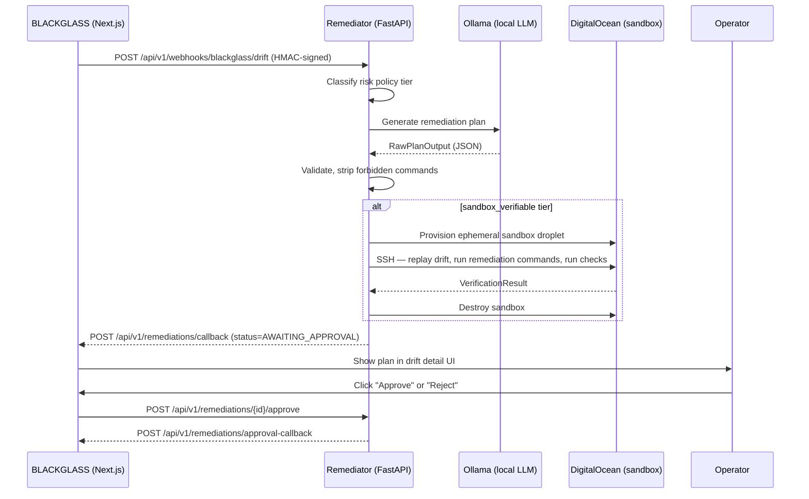

# blackglass-remediator

**Human-in-the-loop AI Remediation Companion for BLACKGLASS.**

The remediator is a standalone Python microservice that receives drift events from BLACKGLASS, classifies them against hard-coded risk policy tiers, generates AI-proposed remediation plans via a local LLM (Ollama), optionally verifies those plans in ephemeral DigitalOcean sandbox VMs, and surfaces them to operators for explicit approval before any action can be taken.

---

## Why this exists

BLACKGLASS detects drift — changes on hosts that deviate from the approved baseline. The remediator answers the question: *"Given this drift, what should an operator do next?"*

The design follows a strict principle: **the AI never executes anything without human approval.** `requires_human_approval` is hard-coded to `True` in application code and cannot be overridden by the LLM.

---

## Architecture



---

## Risk policy tiers

Policy tiers are **hard-coded in application code** (`app/agent/risk_policy.py`), not in prompts. The LLM cannot influence tier classification.

| Tier | Behaviour |
|---|---|
| `safe_guidance_only` | Guidance text only — zero executable commands generated |
| `sandbox_verifiable` | Commands generated + verified in an ephemeral DO sandbox before surfacing |
| `approval_required` | Commands generated, sandbox-verified (when `ENABLE_SANDBOX_VERIFICATION=true`), then **held for explicit human click** before they ever leave the queue |
| `manual_only` | No commands — human must handle manually (e.g. kernel issues) |

> Note on sandbox verification for `approval_required`: the workflow
> (`app/agent/remediation_workflow.py`) runs sandbox verification for both
> `sandbox_verifiable` and `approval_required` tiers when
> `ENABLE_SANDBOX_VERIFICATION=true`. The default in `config.py` is
> `False` for local dev (no DO API token needed); production sets it to
> `True`. See [`docs/safety-model.md`](docs/safety-model.md) § 3.

| Category | Severity | Tier |
|---|---|---|
| `kernel` | any | `manual_only` |
| `ssh`, `authorized_keys`, `identity`, `privilege_escalation` | any | `approval_required` |
| any other category | `high` | `approval_required` |
| `packages`, `firewall`, `systemd`, `cron`, `filesystem`, `network_exposure` | low / medium | `sandbox_verifiable` |
| `persistence`, `other` | low / medium | `safe_guidance_only` (fallback) |

The decision tree is evaluated top-to-bottom in
`app/agent/risk_policy.py::classify_policy_tier()`; the first matching
rule wins, so more restrictive tiers take precedence. The
authoritative source is the code, not this table.

---

## Local development setup

### Prerequisites

- Python 3.12
- [Ollama](https://ollama.com) running locally with `llama3.2:3b` pulled
- PostgreSQL (or use SQLite in-memory for tests)

### Install

```bash
cd blackglass-remediator
python -m venv .venv
source .venv/bin/activate          # Windows: .venv\Scripts\activate
pip install -e ".[dev]"
```

### Configure

```bash
cp .env.example .env
# Edit .env — at minimum set DATABASE_URL
```

### Run

```bash
uvicorn app.main:app --reload --port 8080
# or
python -m app.main
```

### Test

```bash
pytest tests/ -v
```

---

## Environment variables

See [`.env.example`](.env.example) for all available variables.

| Variable | Required | Default | Description |
|---|---|---|---|
| `DATABASE_URL` | Yes | — | Async PostgreSQL URL (`postgresql+asyncpg://...`) |
| `BLACKGLASS_WEBHOOK_SECRET` | In prod | — | HMAC secret matching BLACKGLASS env |
| `BLACKGLASS_API_BASE_URL` | Yes | — | URL of the BLACKGLASS Next.js app |
| `BLACKGLASS_API_TOKEN` | Yes | — | Service token for callback auth |
| `LLM_PROVIDER` | No | `ollama` | `ollama` \| `openai` \| `anthropic` |
| `OLLAMA_BASE_URL` | No | `http://localhost:11434` | Ollama server URL |
| `OLLAMA_MODEL` | No | `llama3.2:3b` | Model identifier |
| `ENABLE_SANDBOX_VERIFICATION` | No | `false` | Enable live DO sandbox verification |
| `DIGITALOCEAN_TOKEN` | If sandbox | — | DO API token |

---

## API endpoints

### Webhooks

```
POST /api/v1/webhooks/blackglass/drift
```
Receives drift events from BLACKGLASS. Validates HMAC signature (when configured), creates a recommendation, and starts background processing.

**Request body (BLACKGLASS → remediator):**
```json
{
  "event": "drift.detected",
  "scan_id": "scan-abc123",
  "tenant_id": "tenant-clerkorg",
  "host_id": "host-do-01",
  "hostname": "prod-nyc3-01",
  "timestamp": "2026-05-06T12:00:00Z",
  "distro": "ubuntu-22.04",
  "kernel": "5.15.0-91-generic",
  "findings": [
    {
      "id": "finding-001",
      "category": "packages",
      "severity": "medium",
      "title": "Unexpected package installed: netcat-traditional",
      "rationale": "netcat-traditional 1.10-47 not in approved package list"
    }
  ],
  "baseline_summary": "No netcat packages in baseline",
  "current_summary": "netcat-traditional 1.10-47 present"
}
```

**Response (202):**
```json
{
  "accepted": true,
  "recommendation_id": "01HZ0X5ABCDE12345678901234"
}
```

### Recommendations

```
GET  /api/v1/remediations/{id}
POST /api/v1/remediations/{id}/approve
POST /api/v1/remediations/{id}/reject
POST /api/v1/remediations/{id}/replay
GET  /api/v1/tenants/{tenant_id}/remediations
```

**Example GET /remediations/{id} response:**
```json
{
  "id": "01HZ0X5ABCDE12345678901234",
  "tenant_id": "tenant-clerkorg",
  "status": "awaiting_approval",
  "risk_policy_tier": "sandbox_verifiable",
  "plan": {
    "summary": "Remove unauthorized netcat-traditional package",
    "confidence_score": 0.82,
    "requires_human_approval": true,
    "commands": [
      {
        "command": "apt-get remove -y netcat-traditional",
        "purpose": "Remove the unauthorized package",
        "risk_level": "low",
        "destructive": false
      }
    ],
    "verification_steps": [...]
  },
  "approved_at": null,
  "created_at": "2026-05-06T12:00:05Z"
}
```

### Health

```
GET /health          # liveness
GET /health/ready    # readiness (checks Ollama availability)
```

---

## BLACKGLASS integration checklist

To fully wire up the BLACKGLASS Next.js app, you need:

1. **Outbound webhook**: Ensure `tenant_id` is included in the drift event webhook payload (currently may not be sent — check `src/app/api/webhooks/` in BLACKGLASS).

2. **Inbound callback endpoint** (`POST /api/v1/remediations/callback`): Receives recommendation status updates from the remediator. Suggested handler:
   ```ts
   // src/app/api/remediations/callback/route.ts
   export async function POST(req: Request) {
     const body = await req.json();
     // body: { tenant_id, recommendation_id, status, summary, confidence_score }
     // Store in your DB, notify UI via realtime channel
   }
   ```

3. **Approval callback endpoint** (`POST /api/v1/remediations/approval-callback`): Receives approve/reject decisions back from the remediator.

4. **Drift detail UI panel**: Add a `RemediationRecommendation` component to the drift detail page showing:
   - Status badge (draft / awaiting_approval / approved / rejected)
   - Plan summary and confidence score
   - Expand/collapse commands list
   - Approve / Reject buttons (calls `POST /api/v1/remediations/{id}/approve` or `/reject`)

---

## Safety model

- **`requires_human_approval` is always `True`** — set in `_to_domain_plan()`, not in the prompt, not configurable by the LLM.
- **Forbidden command patterns** (`FORBIDDEN_COMMAND_PATTERNS` in `app/agent/risk_policy.py`): Any command matching these patterns is stripped before surfacing to the operator. Includes `rm -rf /`, `curl | bash`, `chmod -R 777`, `iptables -F`, and ~20 more.
- **SSH only to sandbox hosts** — `SandboxSSHRunner` only ever connects to ephemeral droplets tagged `blackglass-sandbox`. There is no code path to SSH to production customer hosts.
- **HMAC signature verification** — Webhook endpoint verifies `X-Blackglass-Signature` using constant-time comparison. Unsigned requests are rejected in production (configurable for dev).
- **Tier classification in code, not prompts** — Policy tier is determined by `classify_policy_tier()` before the LLM is ever called. The LLM receives the tier as a constraint, not as something to decide.

---

## Docker

```bash
docker build -t blackglass-remediator .
docker run -p 8080:8080 --env-file .env blackglass-remediator
```

---

## Future roadmap

- [ ] Temporal.io workflow orchestration for long-running verification jobs
- [ ] Slack approval UI (Block Kit buttons → approve/reject directly from Slack)
- [ ] Per-tenant model selection and temperature overrides
- [ ] Explanation audit trail viewable in BLACKGLASS UI
- [ ] Dry-run replay of historical drift events
- [ ] Cost tracking for cloud LLM providers
