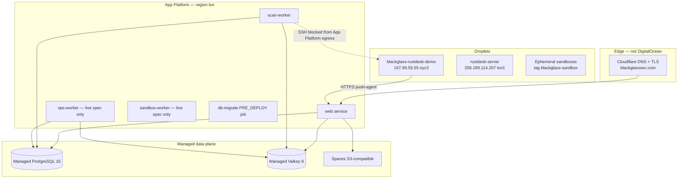

# DigitalOcean product inventory — Blackglass

Single reference for **every DigitalOcean product** this repository touches, where it is configured, and how to find live resources before mothballing or after a long pause.

> **Run the discovery script first:**  
> `DIGITALOCEAN_ACCESS_TOKEN=dop_v1_... node scripts/do/inventory-do-resources.mjs --json > do-inventory-$(date +%Y%m%d).json`

Related runbooks:

- [Mothballing DigitalOcean](./mothballing-digitalocean.md) — safe shutdown order and cost reduction
- [Reactivating DigitalOcean](./reactivating-digitalocean.md) — bring the stack back online
- [Backup & restore drill](./backup-restore-drill.md) — Postgres/Spaces recovery
- [Deployment topology](../architecture/deployment.md) — App Platform vs Helm vs Terraform

---

## Architecture at a glance



**Important platform constraint:** App Platform **cannot SSH-pull** to user-owned Droplets (egress is blackholed). The sales-demo VM uses the **push-agent** (`scripts/systemd/blackglass-agent.sh`) posting to `/api/v1/ingest/agent`.

---

## Product inventory

| # | DO product | Role in Blackglass | Config / docs | Typical identifiers |
|---|------------|-------------------|-----------------|---------------------|
| 1 | **App Platform** | SaaS console (Next.js), scan-worker, db-migrate job | `.do/app-git.production.yaml`, `.do/app-git.staging.yaml`, `.do/README.md` | Apps: `blackglass-production`, `blackglass-staging`; region **`lon`** |
| 2 | **Managed PostgreSQL** | Multi-tenant SaaS schema, audit, billing | `DATABASE_URL`, `drizzle/`, CI `db-migrate.yml` | Cluster ID in CI: `4d063be8-1cc1-4b45-8b57-2a96a9c77161`; Terraform name `blackglass-pg` |
| 3 | **Managed Valkey** (Redis protocol) | BullMQ queues, distributed rate limits | `REDIS_QUEUE_URL`, `RATE_LIMIT_REDIS_URL` | Script default name `blackglass-redis`; Terraform `blackglass-valkey` |
| 4 | **Spaces** | Audit JSONL, baselines, reports, evidence | `DO_SPACES_*` env vars, `scripts/do/configure-spaces-lifecycle.mjs` | Example bucket `blackglass-state`; regions `lon1` / `nyc3` in docs |
| 5 | **Droplets — sales demo** | Live drift story for prospect calls | `COLLECTOR_HOST_1`, `docs/marketing/sales-demo-walkthrough.md` | **`167.99.59.55`**, name `blackglass-rustdesk-demo`, **nyc3** |
| 6 | **Droplets — RustDesk relay** | Screen-share during demos | `docs/runbooks/operations.md` §4c | **`206.189.114.207`**, name `rustdesk-server`, **lon1** |
| 7 | **Droplets — sandboxes** | Remediator verification, retired public showcase | `src/lib/server/services/sandbox-provisioner.ts` | Tag **`blackglass-sandbox`**; auto-created per request |
| 8 | **Droplets — lab** | Operator lab targets | `scripts/do/create-do-droplet.ps1` | Default name `blackglass-lab-01`, region **lon1** |
| 9 | **Block Storage volumes** | Optional baseline/drift JSON on App Platform | Commented in production spec; `scripts/do/create-do-volume.ps1` | Name `blackglass-baselines`, script default **nyc3** |
| 10 | **Cloud Firewalls** | Per-sandbox SSH-only inbound; DB firewall for CI migrations | `sandbox-provisioner.ts`, `.github/workflows/db-migrate.yml` | Created dynamically; not stored in committed env |
| 11 | **Projects** | Console grouping | `scripts/do/do_bootstrap_blackglass.py` | UUID **`2081c029-849a-4286-8b19-27717a597258`** |
| 12 | **Account SSH keys** | Droplet bootstrap, collector | `scripts/do/register-do-key.ps1` | Name **`blackglass-collector`** |
| 13 | **Monitoring metrics API** | Charon idle scoring (CPU/network) | `src/lib/server/janitor/do-client.ts` | `/monitoring/metrics/droplet/...` |
| 14 | **Container Registry (DOCR)** | Self-hosted Helm images (not App Platform Git path) | `deploy/helm/blackglass/values.yaml` | `registry.digitalocean.com/blackglass/...` |
| 15 | **Customer DO API tokens** | Charon cloud janitor (tenant-linked accounts) | `docs/operations/charon.md` | Stored encrypted per tenant — not operator PAT |

### Not on DigitalOcean

| Service | Provider | Notes |
|---------|----------|-------|
| Public DNS | **Cloudflare** | `blackglasssec.com`, `app.`, `staging.` — see `scripts/verify/cloudflare-edge-audit.mjs` |
| Auth | **Clerk** | `CLERK_*` env vars |
| Billing | **Stripe** | Webhooks + subscriptions |
| Email | **Resend** | Transactional / marketing |
| Secrets sync | **Doppler** (optional) | → App Platform; see [doppler-digitalocean-setup.md](./doppler-digitalocean-setup.md) |

---

## Committed vs live App Platform spec

The **committed** production YAML (`.do/app-git.production.yaml`) defines:

| Component | In committed spec? |
|-----------|-------------------|
| `web` | Yes — `professional-xs`, deploy on push from `main` |
| `scan-worker` | Yes — `node dist/worker/scan-worker.cjs` |
| `db-migrate` job | Yes — PRE_DEPLOY `npm run db:migrate` |
| `ops-worker` | **No** — documented in runbooks; may exist only in live DO console |
| `sandbox-worker` | **No** — same |

Before mothballing or reactivating, export the **live** spec:

```bash
doctl apps list
doctl apps spec get <production-app-id> > live-production-spec.yaml
doctl apps spec get <staging-app-id> > live-staging-spec.yaml
```

Store those files **outside git** with your offline inventory JSON.

---

## Environment variables (DO-related)

### Operator / CI

| Variable | Purpose |
|----------|---------|
| `DIGITALOCEAN_ACCESS_TOKEN` / `DO_API_TOKEN` | API access (bootstrap, CI, sandbox provisioner) |
| `DO_APP_ID` / `BLACKGLASS_APP_ID` | Production App Platform app |
| `BLACKGLASS_DO_PROJECT_ID` | DO Project attach (default UUID above) |
| `BLACKGLASS_GITHUB_REPO` | Fork override for bootstrap JSON |
| `TF_VAR_do_token` | Terraform provider |

### App runtime (set as DO App Platform secrets)

| Variable | Product |
|----------|---------|
| `DATABASE_URL`, `PGSSLMODE` | Managed Postgres |
| `REDIS_QUEUE_URL`, `RATE_LIMIT_REDIS_URL` | Managed Valkey |
| `DO_SPACES_KEY`, `DO_SPACES_SECRET`, `DO_SPACES_BUCKET`, `DO_SPACES_ENDPOINT`, `DO_SPACES_REGION` | Spaces |
| `DO_API_TOKEN` | Droplet API (sandbox worker / showcase) |
| `COLLECTOR_HOST_1`, `SSH_PRIVATE_KEY`, `INGEST_*`, `LAB_AGENT_*` | Sales-demo VM + push-agent |
| `SHOWCASE_AUTO_PROVISION_DISABLED` | Public showcase kill-switch (currently **retired**) |

Full list: root [`.env.example`](../../.env.example).

---

## Region map (known inconsistency)

| Resource | Region in repo |
|----------|----------------|
| App Platform prod/staging | **`lon`** (spec slug) |
| Terraform defaults | **`nyc3`** |
| Redis provision script | **`lon1`** |
| Sales-demo Droplet | **`nyc3`** |
| Volume script | **`nyc3`** |
| Spaces examples | **`lon1`** and **`nyc3`** |

When reactivating, **do not assume** all resources are co-located. Latency and firewall trusted-sources must match the App Platform region.

---

## Scripts and automation

| Script | DO API / product |
|--------|------------------|
| [`scripts/do/inventory-do-resources.mjs`](../../scripts/do/inventory-do-resources.mjs) | Read-only inventory (this runbook) |
| [`scripts/do/do_bootstrap_blackglass.py`](../../scripts/do/do_bootstrap_blackglass.py) | Create App + attach Project |
| [`scripts/do/do_apply_stage0.py`](../../scripts/do/do_apply_stage0.py) | Patch `AUTH_REQUIRED` / session secret |
| [`scripts/do/provision-do-redis.ps1`](../../scripts/do/provision-do-redis.ps1) | Create Valkey cluster + trusted source |
| [`scripts/do/configure-spaces-lifecycle.mjs`](../../scripts/do/configure-spaces-lifecycle.mjs) | Spaces lifecycle rules |
| [`scripts/do/create-do-droplet.ps1`](../../scripts/do/create-do-droplet.ps1) | Lab/sales Droplet |
| [`scripts/do/create-do-volume.ps1`](../../scripts/do/create-do-volume.ps1) | Block volume |
| [`scripts/do/register-do-key.ps1`](../../scripts/do/register-do-key.ps1) | Account SSH key |
| [`terraform/digitalocean/main.tf`](../../terraform/digitalocean/main.tf) | Optional managed Postgres + Valkey |

### GitHub Actions using DO

| Workflow | DO usage |
|----------|----------|
| `.github/workflows/ci.yml` | Poll App deployment (`DO_API_TOKEN`, `DO_APP_ID`) |
| `.github/workflows/db-migrate.yml` | Temporarily open Postgres firewall for migrations |
| `.github/workflows/maintenance.yml` | Prune audit rows + Spaces (`DO_SPACES_*`) |
| `.github/workflows/staging-smoke.yml` | Wait for staging App deploy |

---

## Features already retired or disabled

| Feature | Status | Reference |
|---------|--------|-----------|
| Public auto-provisioning showcase | **Retired 2026-05-07** | `SHOWCASE_AUTO_PROVISION_DISABLED=true`; `docs/runbooks/operations.md` §4b |
| GHCR → App Platform deploy | **Removed** | `.do/README.md` |
| Redis on DR path | **Ephemeral by design** | `backup-restore-drill.md` |

Sales-demo VM (`167.99.59.55`) **replaced** the public showcase as the primary live-host story (§4c).

---

## Cost drivers (monthly, approximate tiers)

Use the DO billing console for exact numbers. Typical billable items:

1. App Platform — web + workers + job (`professional-xs` / `basic-xxs`)
2. Managed Postgres — `db-s-1vcpu-1gb` and up
3. Managed Valkey — same size tier
4. Spaces — storage + egress
5. Droplets — demo VM + relay + any leftover sandboxes
6. Block volumes — if attached

**Cheapest mothball:** scale App Platform components to zero / pause app, power off Droplets, keep Postgres if you need data (still billed) or snapshot then destroy.

See [mothballing-digitalocean.md](./mothballing-digitalocean.md) for ordered steps.
