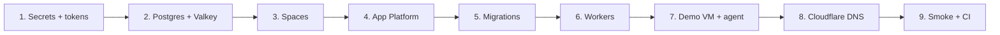

# Reactivating Blackglass on DigitalOcean

Comprehensive guide to **bring the Blackglass stack back online** after mothballing. Read [digitalocean-product-inventory.md](./digitalocean-product-inventory.md) first, and keep your offline bundle handy:

- `do-inventory-*.json`
- `live-production-spec-*.yaml` / `live-staging-spec-*.yaml`
- Secrets export (Doppler / 1Password)
- Cloudflare DNS export
- Postgres snapshot ID or `pg_dump` file (if cluster was destroyed)
- Demo VM SSH key + snapshot name (if Droplet was powered off or rebuilt)

---

## Reactivation overview



**Target RTO:** ≤ 4 hours (see [backup-restore-drill.md](./backup-restore-drill.md)) for a experienced operator with backups intact.

---

## Phase 0 — Preconditions

- [ ] DigitalOcean account in good standing; new **`DIGITALOCEAN_ACCESS_TOKEN`** with read/write scope.
- [ ] GitHub repo access: `thevenomv/blackglass-console` (or your fork) — DO GitHub App authorized.
- [ ] Clerk, Stripe, Resend, Sentry credentials (if SaaS mode).
- [ ] Cloudflare access for `blackglasssec.com`.
- [ ] Local checkout at migration head: `git checkout main && git pull && npm ci`.

Install CLI tools:

```bash
# doctl — https://docs.digitalocean.com/reference/doctl/how-to/install/
doctl auth init
```

---

## Phase 1 — Restore or confirm data plane

### 1a. Managed PostgreSQL

**If cluster was kept during mothball:**

```bash
doctl databases list
doctl databases connection <cluster-id> --format URI
# Set DATABASE_URL in Doppler / DO secrets (port 25060, sslmode=require)
# Use direct port 25060 for migrations — NOT pgbouncer 25061
```

**If cluster was destroyed — restore from snapshot:**

```bash
doctl databases backups list <original-cluster-id-or-name>
doctl databases create blackglass-pg-restored \
  --engine pg --version 16 \
  --region lon1 --size db-s-1vcpu-1gb \
  --restore-from-cluster-id <source-cluster-id> \
  --restore-from-timestamp "<ISO-8601-from-backup>"
```

Or restore from your offline `pg_dump`:

```bash
pg_restore -d "$DATABASE_URL" --no-owner --role=blackglass blackglass-final-YYYYMMDD.dump
```

**Firewall trusted sources:** allow App Platform app ID and your operator IP:

```bash
doctl databases firewalls append <cluster-id> --rule app:<app-platform-app-id>
```

CI migrations use the same pattern in `.github/workflows/db-migrate.yml` (cluster `4d063be8-1cc1-4b45-8b57-2a96a9c77161` — verify ID matches your restored cluster).

### 1b. Managed Valkey (Redis protocol)

**If destroyed, recreate:**

```powershell
# PowerShell — or use DO console
$env:DIGITALOCEAN_ACCESS_TOKEN = "dop_v1_..."
$env:BLACKGLASS_APP_ID = "<app-id-after-phase-4>"
.\scripts\do\provision-do-redis.ps1 -Region lon1 -ClusterName blackglass-redis
```

Or Terraform:

```bash
cd terraform/digitalocean
terraform apply \
  -var="do_token=$DIGITALOCEAN_ACCESS_TOKEN" \
  -var="create_managed_valkey=true" \
  -var="region=lon1"
```

Map outputs to:

- `REDIS_QUEUE_URL` — BullMQ (scans, webhooks, janitor, sandbox)
- `RATE_LIMIT_REDIS_URL` — HTTP rate limiter (can be same cluster at small scale)

**Redis is ephemeral** — expect empty queues after restore; no queue replay required.

---

## Phase 2 — Spaces (if used)

1. Confirm bucket exists in DO console → **Spaces**.
2. Restore keys or create new Spaces key pair → set:
   - `DO_SPACES_KEY`, `DO_SPACES_SECRET`
   - `DO_SPACES_BUCKET`, `DO_SPACES_ENDPOINT` (e.g. `https://lon1.digitaloceanspaces.com`)
   - `DO_SPACES_REGION` (e.g. `lon1`)
3. Reapply lifecycle rules:

```bash
export DO_SPACES_ENDPOINT=...
export DO_SPACES_BUCKET=...
export DO_SPACES_KEY=...
export DO_SPACES_SECRET=...
node scripts/do/configure-spaces-lifecycle.mjs
```

If you synced audit offline during mothball, re-upload:

```bash
aws --endpoint-url "$DO_SPACES_ENDPOINT" s3 sync \
  "./offline-audit-YYYYMMDD/" "s3://${DO_SPACES_BUCKET}/audit/"
```

---

## Phase 3 — App Platform

### Option A — Recreate from committed spec (greenfield)

```bash
cd /path/to/blackglass-console

# 1. Bootstrap minimal app (mock mode) — optional for brand-new account
export DIGITALOCEAN_ACCESS_TOKEN="dop_v1_..."
python scripts/do/do_bootstrap_blackglass.py

# 2. Apply full production spec
doctl apps create --spec .do/app-git.production.yaml
# Note new app ID:
doctl apps list
```

### Option B — Restore from saved live spec (recommended after mothball)

```bash
doctl apps create --spec live-production-spec-YYYYMMDD.yaml
# OR if app still exists but was scaled to 0:
doctl apps update <app-id> --spec live-production-spec-YYYYMMDD.yaml
```

### Post-apply — bind secrets in DO console

For **each** component (`web`, `scan-worker`, `db-migrate` job, and any live-only `ops-worker` / `sandbox-worker`):

| Secret | Required for |
|--------|--------------|
| `DATABASE_URL` | web, scan-worker, db-migrate job |
| `REDIS_QUEUE_URL` | web (if queues), scan-worker, ops-worker |
| `RATE_LIMIT_REDIS_URL` | web |
| `AUTH_SESSION_SECRET` | web (when `AUTH_REQUIRED=true`) |
| `DO_SPACES_*` | web/worker if Spaces stores enabled |
| `SSH_PRIVATE_KEY` or Doppler | scan-worker SSH (demo VM) |
| `INGEST_API_KEY`, `INGEST_HOST_KEYS_JSON` | push-agent path |
| Clerk / Stripe keys | SaaS billing + auth |

Use [doppler-digitalocean-setup.md](./doppler-digitalocean-setup.md) to re-enable Doppler sync.

### Plain env vars to verify (from `.do/app-git.production.yaml`)

```bash
NEXT_PUBLIC_APP_URL=https://blackglasssec.com   # must match build-time URL
NEXT_PUBLIC_USE_MOCK=false
AUTH_REQUIRED=true
COLLECTOR_HOST_1=167.99.59.55
COLLECTOR_HOST_1_NAME=blackglass-rustdesk-demo
LAB_AGENT_HOST_ID=host-167-99-59-55
SHOWCASE_AUTO_PROVISION_DISABLED=true           # showcase stays retired unless you deliberately re-enable
```

Set `instance_count: 1` on `web` and `scan-worker` (and ops/sandbox workers if in your live spec).

Re-enable deploy-on-push when stable:

```yaml
github:
  deploy_on_push: true
```

### Stage-0 auth hardening (one-off)

```bash
export DIGITALOCEAN_ACCESS_TOKEN="dop_v1_..."
export BLACKGLASS_APP_ID="<production-app-id>"
python scripts/do/do_apply_stage0.py
# Note: script searches app name "blackglass" — use BLACKGLASS_APP_ID if name is blackglass-production
```

Or: `npm run do:apply-stage0`

---

## Phase 4 — Database migrations

App Platform **PRE_DEPLOY** job runs `npm run db:migrate` on each deploy. For first reactivation, run manually once:

```bash
export DATABASE_URL="postgresql://..."
export PGSSLMODE=no-verify   # matches DO job env
npm run db:migrate
npm run db:migrate:status
```

**Migration ordering caveats** ([README.md](../../README.md)):

- Migration `008` must run **outside a transaction** → `npm run db:migrate:008`
- Apply RLS migration `007` only after app is live and setting `bg.tenant_id` per request

Or trigger via GitHub Actions: **db-migrate** workflow (requires `DO_API_TOKEN`, `DATABASE_URL` secrets).

---

## Phase 5 — Workers

Committed spec includes **scan-worker** only. Production may also need:

| Worker | Command | When |
|--------|---------|------|
| scan-worker | `node dist/worker/scan-worker.cjs` | `REDIS_QUEUE_URL` set — SSH scans |
| ops-worker | `tsx src/worker/ops/index.ts` or bundled | Webhooks, exports, Charon, retention |
| sandbox-worker | `tsx src/worker/sandbox/index.ts` | Ephemeral Droplet lifecycle |

If missing from spec, add worker block per [runbooks/deploy-scan-worker.md](../runbooks/deploy-scan-worker.md):

```bash
doctl apps update <app-id> --spec live-production-spec-with-workers.yaml
```

Verify worker health indirectly:

```bash
doctl apps logs <app-id> --type run --component scan-worker --follow
```

---

## Phase 6 — Sales-demo VM & push-agent

The demo Droplet is **out-of-band** — not created by App Platform.

### 6a. Power on or restore Droplet

```bash
doctl compute droplet list | grep rustdesk
doctl compute droplet-action power-on <demo-droplet-id>
# OR create from snapshot:
doctl compute droplet create blackglass-rustdesk-demo \
  --image <snapshot-id> --size s-1vcpu-1gb --region nyc3 ...
```

Canonical properties ([operations runbook §4c](../runbooks/operations.md)):

| Field | Value |
|-------|-------|
| IP | `167.99.59.55` (update DNS/env if IP changed) |
| Push-agent host ID | `host-167-99-59-55` |
| Agent timer | 5-minute systemd |

### 6b. Reinstall / verify push-agent

On the VM:

```bash
# From repo on your laptop
scp scripts/systemd/blackglass-agent.sh root@167.99.59.55:/usr/local/bin/
scp scripts/systemd/blackglass-agent.timer root@167.99.59.55:/etc/systemd/system/
# Edit /etc/blackglass-agent.env — INGEST URL, keys, BLACKGLASS_HOST_ID
systemctl enable --now blackglass-agent.timer
```

App Platform must have matching `INGEST_HOST_KEYS_JSON` and `LAB_AGENT_HOST_ID`.

### 6c. Demo reset workflow

Before customer calls:

```bash
ssh root@167.99.59.55 'bash -s' < scripts/lab/reset-drift.sh
# Capture baseline in console, then:
ssh root@167.99.59.55 'bash -s' < scripts/lab/seed-drift.sh
```

Full script: [sales-demo-walkthrough.md](../marketing/sales-demo-walkthrough.md).

### 6d. RustDesk relay (optional)

Power on `rustdesk-server` (`206.189.114.207`, lon1) for screen-share demos.

---

## Phase 7 — Staging environment

```bash
doctl apps create --spec .do/app-git.staging.yaml
# OR restore live-staging-spec-*.yaml
```

Set staging secrets with **separate** `DATABASE_URL` / Spaces bucket. Staging checklist: [staging-deployment-checklist.md](./staging-deployment-checklist.md).

Verify: `https://staging.blackglasssec.com/api/health` (after DNS).

---

## Phase 8 — Cloudflare DNS

Point records back to App Platform default ingress or custom domain configured in DO:

1. DO app → **Settings → Domains** — add `app.blackglasssec.com`, `staging.blackglasssec.com`.
2. Cloudflare — CNAME to `*.ondigitalocean.app` target shown in DO console.
3. Confirm TLS — full (strict) if using Cloudflare origin cert or DO-managed cert.

Run edge audit:

```bash
npm run cf:audit-edge
npm run cf:public-seo-check
```

Set `NEXT_PUBLIC_APP_URL` and redeploy **web + scan-worker** so build-time URLs match.

---

## Phase 9 — External services

| Service | Reactivation |
|---------|--------------|
| **Clerk** | Restore keys; webhook URL `https://<host>/api/webhooks/clerk` |
| **Stripe** | Restore keys; webhook `https://<host>/api/checkout/webhook`; run `npm run stripe:setup` if prices changed |
| **Resend** | Verify domain; `npm run secrets:verify` |
| **Sentry** | DSN in env |
| **GitHub Actions** | Re-enable workflows; set `DO_APP_ID`, `DO_API_TOKEN`, `DATABASE_URL`, `DO_SPACES_*` secrets |

---

## Phase 10 — Smoke tests

### API (operator)

```bash
node scripts/cli/blackglassctl.mjs health --base=https://blackglasssec.com
curl -sS https://blackglasssec.com/api/v1/hosts -H "Cookie: ..."   # or Clerk session
curl -sS -X POST https://blackglasssec.com/api/v1/scans \
  -H "Content-Type: application/json" -d '{"hostIds":["host-167-99-59-55"]}'
```

### Lab agent freshness

```bash
curl -sS https://blackglasssec.com/api/admin/lab-health
# Expect agent ingest within LAB_AGENT_FRESH_WINDOW_SECONDS (900s)
```

### Local quality gate before declaring done

```bash
npm run verify:fast
npm run verify:build
# verify:stage0 may fail on check:rls-bypass on main — see AGENTS.md
```

### Staging verification

```bash
npm run verify:staging   # needs STAGING_URL secret
```

---

## Phase 11 — Re-enable CI/CD

1. Restore GitHub secrets (`DO_APP_ID`, `DO_API_TOKEN`, etc.).
2. Push to `main` → confirm App Platform deploy succeeds.
3. CI polls deployment (`ci.yml`) then runs smoke tests.
4. Re-enable `maintenance.yml` scheduled prunes if using Spaces audit adapter.

---

## Optional — Public showcase sandbox (retired)

Default production should keep **`SHOWCASE_AUTO_PROVISION_DISABLED=true`**.

To re-enable per-visitor ephemeral Droplets ([operations §4b](../runbooks/operations.md)):

1. Unset or set `SHOWCASE_AUTO_PROVISION_DISABLED=false`
2. Set `SANDBOX_SHOWCASE_TENANT_ID`, `DO_API_TOKEN`, showcase SSH keypair env vars
3. Add **sandbox-worker** to App Platform spec
4. Redeploy; monitor `GET /api/health/showcase` body `status` → `ok`

Historical ops scripts under `scripts/ops/_*-showcase*.mjs` were removed — restore from git history if needed.

---

## Optional — Charon (DO customer API)

Tenants link their own DO PATs for cloud janitor scans. Operator checklist: [charon.md](./charon.md).

Requires **ops-worker** running and `DO`-scoped tokens stored per tenant (encrypted).

---

## Optional — blackglass-remediator (Python)

Separate from App Platform; optional AI remediation service:

```bash
cd blackglass-remediator
python -m venv .venv && source .venv/bin/activate
pip install -e ".[dev]"
# Set DATABASE_URL, BLACKGLASS_API_BASE_URL, DIGITALOCEAN_TOKEN
uvicorn app.main:app --reload --port 8080
```

Sandbox verification needs sandbox-worker + `DO_API_TOKEN`.

---

## Troubleshooting

| Symptom | Likely cause | Fix |
|---------|--------------|-----|
| 500 on `/api/v1/*` after deploy | Migrations not applied | `npm run db:migrate`; check PRE_DEPLOY job logs |
| Scans stuck queued | scan-worker down or no Redis | Scale scan-worker; verify `REDIS_QUEUE_URL` |
| SSH scans fail from App Platform | Expected — egress blackhole | Use push-agent on demo VM |
| Lab health stale | Agent timer stopped or wrong ingest key | SSH to demo VM; check `blackglass-agent.timer` |
| Rate limits inconsistent | `RATE_LIMIT_REDIS_URL` unset | Set same Valkey URL on web tier |
| `do_apply_stage0` can't find app | App named `blackglass-production` | Set `BLACKGLASS_APP_ID` explicitly |
| Build wrong canonical URLs | `NEXT_PUBLIC_APP_URL` mismatch | Fix env; **redeploy web** (build-time var) |

More: [troubleshooting-local-build.md](./troubleshooting-local-build.md), [operator-guide.md](./operator-guide.md).

---

## Reactivation checklist (printable)

- [ ] Postgres reachable; `DATABASE_URL` in all components  
- [ ] Valkey reachable; queue + rate-limit URLs set  
- [ ] Spaces keys + bucket (if used)  
- [ ] App Platform web + scan-worker at `instance_count ≥ 1`  
- [ ] ops-worker / sandbox-worker if needed for your feature set  
- [ ] `npm run db:migrate` succeeded  
- [ ] Demo VM powered on; push-agent timer active  
- [ ] `COLLECTOR_HOST_1` / `LAB_AGENT_HOST_ID` match VM  
- [ ] Cloudflare DNS → App Platform  
- [ ] Clerk / Stripe webhooks updated  
- [ ] `blackglassctl health` OK  
- [ ] Test scan completes  
- [ ] CI secrets restored  

---

## Related docs

- [DigitalOcean product inventory](./digitalocean-product-inventory.md)
- [Mothballing DigitalOcean](./mothballing-digitalocean.md)
- [Deployment topology](../architecture/deployment.md)
- [.do/README.md](../../.do/README.md)
- [Backup & restore drill](./backup-restore-drill.md)
